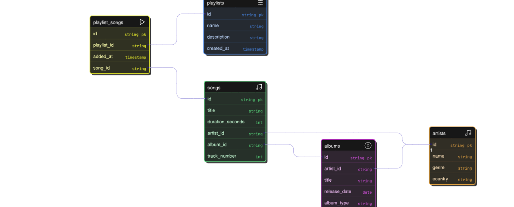

# Design Document

By aryan suthar

Video overview: <https://www.youtube.com/watch?v=ftDTwDMCyWA>

## Scope

In this section you should answer the following questions:

* What is the purpose of your database?  The purpose of this database is to organize and manage music data in a way that allows users to easily find their favorite songs.
* Which people, places, things, etc. are you including in the scope of your database? For your “Find Your Favorite Songs” (Artists, Albums, Playlists, Songs) database, here’s the scope
* Which people, places, things, etc. are *outside* the scope of your database?For your “Find Your Favorite Songs” database (Artists, Albums, Songs, Playlists)

## Functional Requirements

In this section you should answer the following questions:

* What should a user be able to do with your database? A user should be able to search, view, add, update, and delete songs, artists, albums, and playlists to easily find and organize their favorite music.
* What's beyond the scope of what a user should be able to do with your database? The database is only for storing and organizing song-related information (artists, albums, playlists, songs).
It does not cover streaming, accounts, payments, or social features like real Spotify.

## Representation
Entities are captured in SQLite tables with the following schema.
### Entities
The database includes the following entities:
#### songs
The songs table includes:

song_id, which specifies the unique ID for the song as an INTEGER.
This column has the PRIMARY KEY constraint applied, so each song will have a unique identifier.

name, which specifies the song’s name as VARCHAR(20).
Here, VARCHAR(20) means the song’s name can have up to 20 characters.

album_id, which specifies the ID of the album that the song belongs to.
It is stored as an INTEGER and is linked to the albums table through a FOREIGN KEY constraint.
This ensures that every song must belong to an existing album in the albums table.

lonch_date, which specifies the date on which the song was launched.
The column is of type DATE, making it suitable for storing calendar dates (YYYY-MM-DD).
#### artists
The artists table includes:

artist_id, which specifies the unique ID for the artist as an INTEGER.
This column has the PRIMARY KEY constraint applied, so each artist is uniquely identified by this ID.

name, which specifies the artist’s name as VARCHAR(20).
Here, VARCHAR(20) means the artist’s name can be up to 20 characters long.

Birth_date, which specifies the artist’s date of birth.
The column uses the DATE type, making it suitable for storing values like YYYY-MM-DD.

birth_country, which specifies the artist’s country of birth.
The column uses the TEXT type, appropriate for storing country names of varying length.
#### albums
The albums table includes:

album_id, which specifies the unique ID for the album as an INTEGER.
This column has the PRIMARY KEY constraint applied and is set to AUTOINCREMENT, meaning a new unique ID will automatically be generated for each album inserted into the table.

name, which specifies the album’s name as VARCHAR(20).
This allows up to 20 characters for the album title.

artist_id, which specifies the ID of the artist who created the album.
It is stored as an INTEGER and is linked to the artists table through a FOREIGN KEY constraint.
This ensures that every album must be associated with a valid artist from the artists table.
#### playlist
The playlists table includes:

playlist_id, which specifies the unique ID for the playlist as an INTEGER.
This column has the PRIMARY KEY constraint applied, so each playlist is uniquely identified by this ID.

name, which specifies the playlist’s name.
The column is defined as TEXT, allowing flexible-length names for the playlists.

created_at, which specifies the date when the playlist was created.
It is defined as DATE and has a default value of DATE('now').
This means that if no date is provided during insertion, the current date (at the time of record creation) will be automatically stored.
##### playlist_song
The playlist_song table includes:

playlist_id, which specifies the ID of the playlist.
It is stored as an INTEGER and is linked to the playlists table through a FOREIGN KEY constraint.
This ensures that the playlist must exist in the playlists table.

song_id, which specifies the ID of the song.
It is stored as an INTEGER and is linked to the songs table through a FOREIGN KEY constraint.
This ensures that the song must exist in the songs table.

PRIMARY KEY (playlist_id, song_id), which creates a composite primary key.
This ensures that the same song cannot be added more than once to the same playlist, but the same song can exist in different playlists.
### Relationships

The below entity relationship diagram describes the relationships among the entities in the database.

An artist is capable of creating 0 to many albums:
0 if the artist has not released any album yet.
Many if the artist has released multiple albums.
Each album is associated with one and only one artist.
An album is associated with 0 to many songs:
0 if no songs have been added to the album yet.
Many if the album contains multiple songs.
Each song belongs to one and only one album.
An artist is also associated with 0 to many songs (directly):
0 if the artist hasn’t released any song.
Many if the artist has created multiple songs.
Each song is performed by one and only one artist.
A playlist can contain 0 to many songs, and a song can appear in 0 to many playlists:
0 if the playlist is empty or if the song has not been added to any playlist
Many if multiple songs are added to the playlist or if a song is added to multiple playlists.
This many-to-many relationship is implemented through the playlist_songs table.
The playlist_songs table associates one playlist with one song at a time:
It prevents duplicates by using the combination (playlist_id, song_id) as a unique pair.
It can also store metadata (like when a song was added).

## Optimizations

Per the typical queries in `queries.sql`, it is common for users of the database to search for songs by artist name, song title, or album. For that reason, indexes are created on the `artist_name`, `title`, and `album` columns in the `songs` table to speed up the retrieval of songs based on those attributes.

Similarly, users often filter songs by genre or release year. As such, additional indexes are created on the `genre` and `release_year` columns to improve the performance of those common queries.

## Limitations

The current schema assumes that each song is attributed to a single artist. However, many songs feature multiple artists or collaborations. Supporting such cases would require introducing a many-to-many relationship between songs and artists.

Additionally, the schema does not currently track song play history or user-specific interactions like likes, skips, or playlists. Supporting such personalized features would require separate tables for users and their activity logs.
